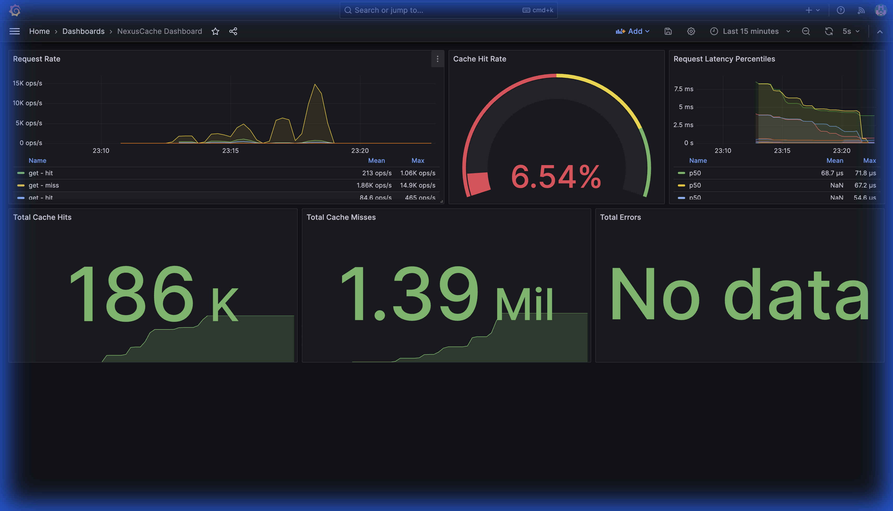

# NexusCache

<div align="center">


**A high-performance distributed caching system built in Go**

_Inspired by GroupCache, enhanced with etcd service discovery, gRPC communication, cache expiration, and hot data replication_

[Quick Start](#quick-start) •
[Architecture](#architecture) •
[Benchmarks](#benchmarks) •
[Monitoring](#monitoring)

</div>

---

## ✨ Features

- **Distributed Caching**: Multi-node cache with consistent hashing for even key distribution
- **Service Discovery**: Dynamic node registration and discovery via etcd
- **gRPC Communication**: High-performance binary protocol for inter-node requests
- **Cache Expiration (TTL)**: Automatic expiration with randomized jitter to prevent stampedes
- **Hot Data Replication**: Frequently accessed data replicated across all nodes
- **Singleflight**: Request deduplication to prevent cache stampedes
- **LRU Eviction**: Least Recently Used eviction when memory limit is reached
- **Prometheus Metrics**: Built-in observability with cache hit rates, latency percentiles

---

## 🚀 Quick Start

### One-Command Demo (Docker)

```bash
# Clone the repository
git clone https://github.com/yourusername/nexuscache.git
cd nexuscache

# Start 3-node cluster with etcd, Prometheus, and Grafana
docker-compose up --build

# Wait for services to start (about 30 seconds)
```

### Test the Cache

```bash
# Set a value
curl -X POST "http://localhost:9999/api/set" \
  -d "key=user1&value=John Doe&expire=5&hot=false"

# Get the value
curl "http://localhost:9999/api/get?key=user1"
# Output: value=John Doe

# Set hot data (replicated to all nodes)
curl -X POST "http://localhost:9999/api/set" \
  -d "key=popular&value=Hot Data!&expire=5&hot=true"

# Access from any node
curl "http://localhost:9997/api/get?key=popular"  # Node 3
curl "http://localhost:9998/api/get?key=popular"  # Node 2
```

### Access Monitoring

- **Grafana Dashboard**: http://localhost:3000 (admin/admin)
- **Prometheus**: http://localhost:9090
- **Node 1 API**: http://localhost:9999
- **Node 2 API**: http://localhost:9998
- **Node 3 API**: http://localhost:9997

---

## 📊 Benchmarks

Run the benchmark suite:

```bash
cd benchmark
go run loadtest.go -duration=30s -concurrency=50 -keys=100 -read-ratio=0.8
```

### Benchmark Results by Environment

| Environment             | Throughput         | P50 Latency | P95 Latency | P99 Latency | Hit Rate |
| ----------------------- | ------------------ | ----------- | ----------- | ----------- | -------- |
| **macOS M4 Air**        | **23,432 ops/sec** | **713µs**   | 1.81ms      | 3.67ms      | 100%     |
| Windows (Ryzen 7 4800H) | 1,565 ops/sec      | 4.4ms       | 153.6ms     | 180.3ms     | 100%     |

> **Note:** Performance varies significantly between environments due to Docker
> virtualization overhead. macOS with Apple Silicon shows ~15x better throughput
> due to near-native container performance vs WSL2 virtualization on Windows.

### Grafana Dashboard



_The pre-configured Grafana dashboard shows real-time request rates, cache hit rates, and latency percentiles._

---

## 🏗️ Architecture

```
                    ┌──────────────────────────────────────────┐
                    │              Client Request              │
                    └─────────────────┬────────────────────────┘
                                      │
                                      ▼
                    ┌──────────────────────────────────────────┐
                    │           HTTP API Gateway               │
                    │              (Port 9999)                 │
                    └─────────────────┬────────────────────────┘
                                      │
                    ┌─────────────────┼─────────────────┐
                    │                 │                 │
                    ▼                 ▼                 ▼
            ┌───────────┐     ┌───────────┐     ┌───────────┐
            │   Node 1  │────▶│   Node 2  │────▶│   Node 3  │
            │  (svc1)   │◀────│  (svc2)   │◀────│  (svc3)   │
            └─────┬─────┘     └─────┬─────┘     └─────┬─────┘
                  │                 │                 │
                  │     gRPC        │     gRPC        │
                  │                 │                 │
                  └────────────┬────┴────────────────┘
                               │
                               ▼
                    ┌──────────────────────────────────────────┐
                    │              etcd Cluster                │
                    │        (Service Discovery & Health)      │
                    └──────────────────────────────────────────┘
```

### Key Components

| Component           | Description                                            |
| ------------------- | ------------------------------------------------------ |
| **Group**           | Cache namespace with getter callback and singleflight  |
| **Consistent Hash** | Virtual nodes (50 per real node) for even distribution |
| **LRU Cache**       | Doubly-linked list + hashmap with TTL support          |
| **gRPC Server**     | Handles remote Get/Set from peer nodes                 |
| **etcd Client**     | Service registration with lease-based health checks    |

---

## 🔧 API Reference

### GET /api/get

Retrieve a cached value.

```bash
curl "http://localhost:9999/api/get?key=mykey"
```

### POST /api/set

Store a value in the cache.

```bash
curl -X POST "http://localhost:9999/api/set" \
  -d "key=mykey&value=myvalue&expire=10&hot=false"
```

| Parameter | Type   | Description                        |
| --------- | ------ | ---------------------------------- |
| `key`     | string | Cache key                          |
| `value`   | string | Value to store                     |
| `expire`  | int    | TTL in minutes (max 4320 = 3 days) |
| `hot`     | bool   | If true, replicate to all nodes    |

### POST /setpeer

Re-add a recovered node to the hash ring.

```bash
curl -X POST "http://localhost:9999/setpeer" -d "peer=svc2"
```

---

## 📈 Monitoring

### Prometheus Metrics

| Metric                                | Type      | Description                            |
| ------------------------------------- | --------- | -------------------------------------- |
| `nexuscache_requests_total`           | Counter   | Total requests by operation and status |
| `nexuscache_request_duration_seconds` | Histogram | Request latency distribution           |
| `nexuscache_cache_size_bytes`         | Gauge     | Current cache memory usage             |
| `nexuscache_peer_requests_total`      | Counter   | Inter-node request count               |

### Grafana Dashboard

Pre-configured dashboard shows:

- Request rate (ops/sec)
- Cache hit rate percentage
- Latency percentiles (p50, p95, p99)
- Total hits, misses, and errors

---

## 🛠️ Development

### Prerequisites

- Go 1.24+
- Docker & Docker Compose
- etcd (for local development without Docker)

### Local Development

```bash
# Set environment
export IP_ADDRESS=127.0.0.1

# Start etcd
docker run -d -p 2379:2379 quay.io/coreos/etcd:v3.5.9 \
  /usr/local/bin/etcd --listen-client-urls http://0.0.0.0:2379 --advertise-client-urls http://127.0.0.1:2379

# Run a single node
go run . --name svc1 --peer svc1 --etcd 127.0.0.1:2379
```

### Run Tests

```bash
go test ./... -v
```

---

## 📁 Project Structure

```
nexuscache/
├── nexuscache/          # Core cache logic
│   ├── group.go          # Cache groups with singleflight
│   ├── server.go         # gRPC server implementation
│   ├── cache.go          # Thread-safe LRU wrapper
│   └── byteview.go       # Immutable cache value
├── connect/              # Network layer
│   ├── register.go       # etcd registration
│   ├── discover.go       # Service discovery
│   ├── client.go         # gRPC client
│   └── peers.go          # Peer interfaces
├── consistenthash/       # Consistent hashing
├── lru/                  # LRU cache implementation
├── singleflight/         # Request deduplication
├── metrics/              # Prometheus metrics
├── benchmark/            # Load testing tools
├── grafana/              # Grafana dashboards
└── docker-compose.yml    # Multi-node deployment
```

---

## 🤝 Contributing

Contributions are welcome! Please feel free to submit a Pull Request.

---

## 📄 License

This project is licensed under the MIT License - see the [LICENSE](LICENSE) file for details.

---

## 🙏 Acknowledgments

- Inspired by [GroupCache](https://github.com/golang/groupcache) by Brad Fitzpatrick
